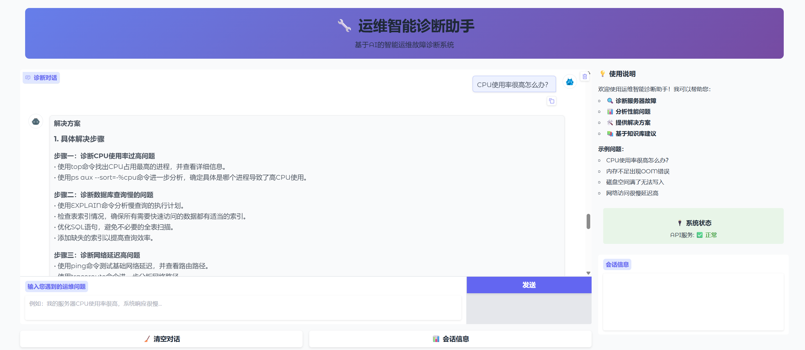
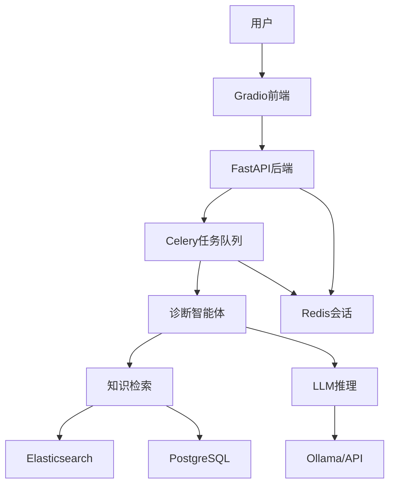

## 📋 GitHub项目说明文档

创建 `README.md`：

```markdown
# 🔧 运维智能诊断助手 (Ops Diagnosis Assistant)

[](https://www.python.org/)
[](https://fastapi.tiangolo.com/)
[](https://langchain-ai.github.io/langgraph/)
[](https://www.docker.com/)
[](LICENSE)

一个基于大语言模型的智能运维故障诊断系统，通过多轮对话引导用户完成自动化排障，降低对运维人员经验的依赖。

## ✨ 核心特性

### 🎯 智能诊断
- **多轮对话诊断**: 基于LangGraph的状态机工作流，实现自然的对话式诊断
- **主动信息收集**: 智能体能够主动询问关键故障信息
- **知识库驱动**: 集成PostgreSQL和Elasticsearch，基于真实运维知识生成建议
- **根因分析**: 结合症状和知识库进行深度根本原因分析

### 🚀 技术架构
- **后端框架**: FastAPI + LangGraph + LangChain
- **AI模型**: 支持Ollama本地模型和云端API
- **异步处理**: Celery + Redis 处理长时间诊断任务
- **数据存储**: PostgreSQL + Elasticsearch + Redis
- **前端界面**: Gradio构建的友好聊天界面
- **容器化**: Docker Compose一键部署

### 🛡️ 生产就绪
- **API认证**: JWT风格的API密钥认证
- **会话管理**: Redis持久化会话存储
- **健康检查**: 完整的服务健康监控
- **错误处理**: 完善的错误处理和日志记录

## 🏗️ 系统架构



## 🚀 快速开始

### 环境要求

- Docker & Docker Compose
- Python 3.11+ (本地开发)
- Ollama (用于本地模型推理)

### 一键部署

1. **克隆项目**
```bash
git clone https://github.com/codewithwu/intelligent-ops-agent.git
cd intelligent-ops-agent/ops-diagnosis-assistant
```

2. **运行部署脚本**
```bash
chmod +x deploy.sh
./deploy.sh
```

3. **访问服务**
   - 前端界面: http://localhost:7860
   - API文档: http://localhost:8000/docs
   - 健康检查: http://localhost:8000/health

### 手动安装（开发环境）

1. **安装依赖**
```bash
pip install -r requirements.txt
```

2. **启动基础设施**
```bash
docker-compose up -d postgres elasticsearch redis
```

3. **初始化数据库**
```bash
python src/data/sample_data.py
```

4. **启动服务**
```bash
# 终端1: API服务
python run_advanced_api.py

# 终端2: Celery Worker
python run_celery_worker.py

# 终端3: 前端界面
python src/frontend/gradio_app.py
```

## 📚 使用指南

### 基本使用

1. **打开前端界面** http://localhost:7860
2. **输入运维问题**，例如：
   - "我的服务器CPU使用率很高"
   - "内存不足出现OOM错误"
   - "磁盘空间满了无法写入"
3. **多轮对话**，智能体会主动询问关键信息
4. **获取解决方案**，包含具体命令和操作步骤

### API使用

```python
import requests

# 配置
API_URL = "http://localhost:8000"
API_KEY = "default_secret_key"

headers = {
    "X-API-Key": API_KEY,
    "Content-Type": "application/json"
}

# 提交诊断任务
response = requests.post(f"{API_URL}/diagnose/async", json={
    "message": "服务器CPU使用率很高"
}, headers=headers)

task_id = response.json()["task_id"]
session_id = response.json()["session_id"]

# 查询任务状态
status_response = requests.get(f"{API_URL}/tasks/{task_id}", headers=headers)
print(status_response.json())
```

## 🔧 配置说明

### 环境变量

创建 `.env` 文件：

```env
# 数据库配置
POSTGRES_HOST=localhost
POSTGRES_PORT=5432
POSTGRES_DB=ops_knowledge
POSTGRES_USER=postgres
POSTGRES_PASSWORD=password

# Elasticsearch配置
ELASTICSEARCH_HOST=localhost
ELASTICSEARCH_PORT=9200

# Redis配置
REDIS_HOST=localhost
REDIS_PORT=6379

# Celery配置
CELERY_BROKER_URL=redis://localhost:6379/0
CELERY_RESULT_BACKEND=redis://localhost:6379/0

# Ollama配置
OLLAMA_BASE_URL=http://localhost:11434
OLLAMA_MODEL=llama3.1:8b

# 安全配置
API_KEY=your_secret_key_here
```

### 模型配置

支持多种LLM配置：

1. **Ollama本地模型** (默认)
```env
OLLAMA_BASE_URL=http://localhost:11434
OLLAMA_MODEL=llama3.1:8b
```

2. **OpenAI API**
```python
# 修改 src/core/advanced_agent_fixed.py
from langchain_openai import ChatOpenAI
self.llm = ChatOpenAI(model="gpt-4", temperature=0.1)
```

## 🗂️ 项目结构

```
ops-diagnosis-assistant/
├── src/
│   ├── api/                 # FastAPI后端
│   │   ├── main.py         # 基础API
│   │   └── advanced_main.py # 高级API（推荐）
│   ├── core/               # 核心逻辑
│   │   ├── advanced_agent_fixed.py    # 高级诊断智能体
│   │   ├── knowledge_retriever.py     # 知识检索
│   │   └── session_manager.py         # 会话管理
│   ├── data/               # 数据管理
│   │   ├── sample_data.py  # 示例数据
│   │   └── es_sync.py      # ES数据同步
│   ├── tasks/              # Celery任务
│   │   └── diagnosis_tasks.py
│   └── frontend/           # 前端界面
│       └── gradio_app.py
├── docker/                 # Docker配置
│   └── init/              # 数据库初始化
├── requirements.txt        # Python依赖
├── docker-compose.yml     # 服务编排
├── deploy.sh              # 部署脚本
└── README.md              # 项目说明
```

## 🛠️ 开发指南

### 添加新的故障类型

1. **在知识库中添加案例**
```python
# 在 src/data/sample_data.py 中添加
{
    "fault_type": "new_issue",
    "symptoms": "故障现象描述",
    "root_cause": "根本原因分析",
    "solution": "解决方案步骤",
    "severity": "medium",
    "frequency": "occasional"
}
```

2. **更新信息收集模板**
```python
# 在 AdvancedDiagnosisAgent 类中更新
self.info_templates = {
    # ... 现有配置
    "new_issue": ["关键信息1", "关键信息2", "关键信息3"]
}
```

### 自定义诊断流程

修改 `src/core/advanced_agent_fixed.py` 中的工作流：

```python
def _build_graph(self):
    workflow = StateGraph(AdvancedDiagnosisState)
    
    # 添加自定义节点
    workflow.add_node("custom_node", self._custom_node)
    
    # 修改路由逻辑
    workflow.add_conditional_edges(
        "collect_symptoms",
        self._custom_routing_logic
    )
```

## 📊 API文档

### 主要端点

| 端点 | 方法 | 描述 | 认证 |
|------|------|------|------|
| `/` | GET | API信息 | 否 |
| `/health` | GET | 健康检查 | 否 |
| `/diagnose/async` | POST | 异步诊断 | 是 |
| `/tasks/{task_id}` | GET | 任务状态 | 是 |
| `/sessions/{session_id}` | GET | 会话信息 | 是 |
| `/sessions` | GET | 所有会话 | 是 |

### 请求示例

```bash
# 提交诊断任务
curl -X POST "http://localhost:8000/diagnose/async" \
  -H "X-API-Key: default_secret_key" \
  -H "Content-Type: application/json" \
  -d '{"message": "服务器CPU使用率很高"}'

# 查询任务状态
curl -X GET "http://localhost:8000/tasks/{task_id}" \
  -H "X-API-Key: default_secret_key"
```

## 🐛 故障排除

### 常见问题

1. **Ollama连接失败**
   - 确保Ollama服务运行：`ollama serve`
   - 检查模型是否下载：`ollama list`

2. **数据库连接失败**
   - 检查PostgreSQL服务状态
   - 验证连接配置 in `.env`

3. **Celery任务失败**
   - 查看Worker日志：`docker-compose logs celery-worker`
   - 检查Redis连接

4. **前端无法连接API**
   - 验证API服务运行状态
   - 检查CORS配置

### 日志查看

```bash
# 查看所有服务日志
docker-compose logs -f

# 查看特定服务日志
docker-compose logs -f api
docker-compose logs -f celery-worker
docker-compose logs -f frontend
```

## 🤝 贡献指南

我们欢迎社区贡献！请阅读以下指南：

1. Fork本项目
2. 创建特性分支 (`git checkout -b feature/AmazingFeature`)
3. 提交更改 (`git commit -m 'Add some AmazingFeature'`)
4. 推送到分支 (`git push origin feature/AmazingFeature`)
5. 开启Pull Request

### 开发环境设置

```bash
# 1. 克隆项目
git clone https://github.com/yourusername/ops-diagnosis-assistant.git
cd ops-diagnosis-assistant

# 2. 创建虚拟环境
python -m venv venv
source venv/bin/activate  # Linux/Mac
# venv\Scripts\activate  # Windows

# 3. 安装依赖
pip install -r requirements.txt

# 4. 启动开发环境
docker-compose up -d postgres elasticsearch redis
python src/data/sample_data.py
python run_advanced_api.py
```

## 📄 许可证

本项目采用 MIT 许可证 - 查看 [LICENSE](LICENSE) 文件了解详情。

## 🙏 致谢

- [LangChain](https://github.com/langchain-ai/langchain) - LLM应用开发框架
- [LangGraph](https://github.com/langchain-ai/langgraph) - 状态机和工作流
- [FastAPI](https://fastapi.tiangolo.com/) - 现代Python Web框架
- [Gradio](https://gradio.app/) - 快速构建AI界面

## 📞 支持

如果你遇到问题或有建议：

1. 查看 [Issues](https://github.com/yourusername/ops-diagnosis-assistant/issues)
2. 创建新的Issue
3. 发送邮件到: your-email@example.com

---

<div align="center">

**如果这个项目对你有帮助，请给它一个⭐️星标！**
